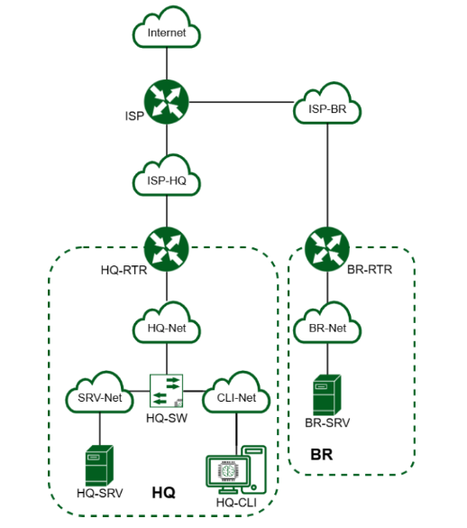

# Решение демонстрационного экзамена 2026 года по специальности «Сетевое и системное администрирование» 09.02.06
## [Модуль #1](CODE_09.02.06-1-2026_Volume_1.pdf) (стр. 41-48)
---

<strong>Рис. 1. Топология сети</strong>

---
## 1. Произведите базовую настройку устройств
